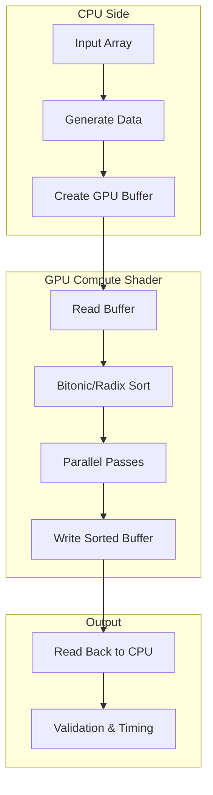

<div class="quick-stats">
  <div class="stat">
    <span class="stat-value">10-100×</span>
    <span class="stat-label">Speedup vs CPU</span>
  </div>
  <div class="stat">
    <span class="stat-value">1M+</span>
    <span class="stat-label">Elements Sorted</span>
  </div>
  <div class="stat">
    <span class="stat-value">&lt;1ms</span>
    <span class="stat-label">GPU Latency</span>
  </div>
  <div class="stat">
    <span class="stat-value">61</span>
    <span class="stat-label">Tests</span>
  </div>
</div>

## Quick Start

```typescript
import { GPUContext, BitonicSorter } from 'webgpu-sorting';

// Initialize WebGPU context
const gpu = new GPUContext();
await gpu.initialize();

// Create sorter
const sorter = new BitonicSorter(gpu);

// Sort data on GPU
const data = new Uint32Array([5, 2, 8, 1, 9, 3, 7, 4, 6, 0]);
const { sortedData } = await sorter.sort(data);

console.log(sortedData); // [0, 1, 2, 3, 4, 5, 6, 7, 8, 9]
```

## Browser Support

<div class="browser-grid">
  <div class="browser-item supported">
    <div class="browser-icon">🌐</div>
    <span class="browser-name">Chrome 113+</span>
    <span class="browser-status">Supported</span>
  </div>
  <div class="browser-item supported">
    <div class="browser-icon">🌊</div>
    <span class="browser-name">Edge 113+</span>
    <span class="browser-status">Supported</span>
  </div>
  <div class="browser-item partial">
    <div class="browser-icon">🦊</div>
    <span class="browser-name">Firefox Nightly</span>
    <span class="browser-status">Flag Required</span>
  </div>
  <div class="browser-item partial">
    <div class="browser-icon">🧭</div>
    <span class="browser-name">Safari 18+</span>
    <span class="browser-status">macOS 14+</span>
  </div>
</div>

## Why GPU Sorting?

GPU sorting becomes advantageous when:

- **Array size > 65,536 elements** - The overhead of GPU buffer transfer is amortized
- **Batch processing** - Multiple sorts can share GPU context
- **Real-time applications** - Low-latency sorting for visualizations, simulations
- **Integer-heavy workloads** - Radix sort excels on Uint32Array data

Use the [interactive demo](/demo/) to benchmark on your own hardware and determine the crossover point for your use case.

## Architecture Overview



Learn more in the [Architecture](/architecture) documentation.
